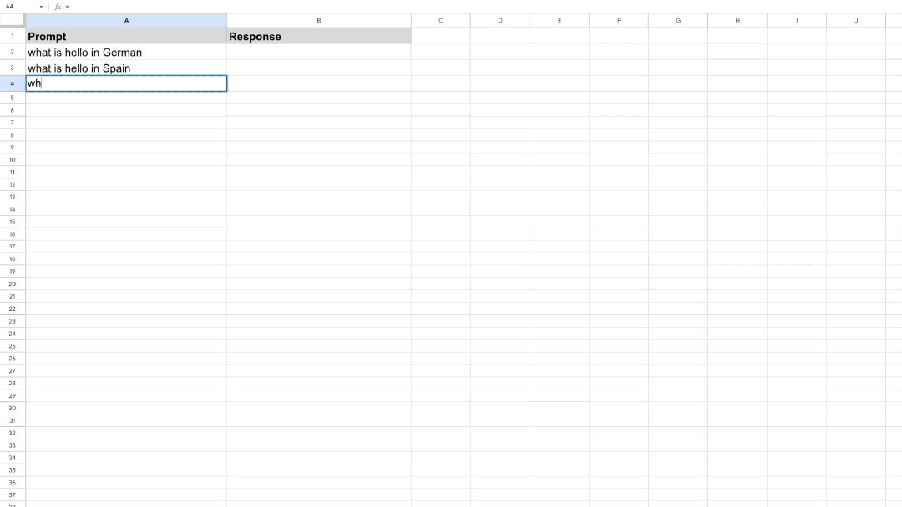

<!--
Copyright 2023 Google LLC

Licensed under the Apache License, Version 2.0 (the "License");
you may not use this file except in compliance with the License.
You may obtain a copy of the License at

      http://www.apache.org/licenses/LICENSE-2.0

Unless required by applicable law or agreed to in writing, software
distributed under the License is distributed on an "AS IS" BASIS,
WITHOUT WARRANTIES OR CONDITIONS OF ANY KIND, either express or implied.
See the License for the specific language governing permissions and
limitations under the License.
-->
# GemSheet: Use generative AI directly from a Google Spreadsheet

**Disclaimer: This is not an official Google product.**

## Overview

**GemSheet** is an open-source solution to use generative AI directly from a Google Spreadsheet.

## Getting Started

To get started With GemSheet:
1. Make a copy of the Google Sheets [spreadsheet template](https://docs.google.com/spreadsheets/d/1_FOgenBtqLePLxZJwN30GumValMpBWT8T4caQLFJYyk/)
2. Follow the instructions detailed in the Getting Started worksheet

## Problem
Currently, there is no integration between Google Cloud's AI Services such as Vertex AI
and Google Sheets. Additionally querying in bulk is not possible out of the box
and requires custom implementation of the Vertex AI service endpoints.

## Solution
**GemSheet** allows users to quickly experiment with different AI use cases (e.g. text or image generation)
in a Google Sheet. The results are written back in the same sheet so they can be easily integrated into existing
workflows that handle Google Sheets data.
